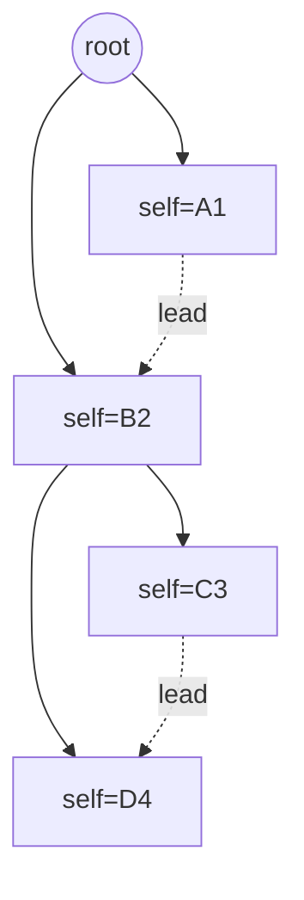

# 04. Ядро CRDT: Land и порядок

Самая рискованная часть проекта. Всё остальное — обвязка.

---

## 1. Land — что это

Единица **синхронизации**, **прав** и **шифрования** одновременно. Внутри —
плоский набор юнитов и индексы над ними.

```ts
export class Land {
  constructor(readonly ctx: Ctx, readonly id: LandId) {}

  // индексы (все — ReactiveMap, гранулярность по ключу)
  readonly passes = new ReactiveMap<PeerStr, Pass>()
  readonly gifts  = new ReactiveMap<PeerStr, Gift>()          // кому → права
  readonly sealsByShot = new ReactiveMap<ShotStr, Seal>()
  readonly sealsByItem = new ReactiveMap<HashStr, Seal>()
  readonly sands  = new ReactiveMap<HeadStr, ReactiveMap<PeerStr, ReactiveMap<SelfStr, Sand>>>()

  readonly faces = new FaceMap()

  loading(): void                       // гидрация из хранилища (Suspense)
  applyPack(pack: Pack): void         // приём извне с проверкой
  diff(skip?: FaceMap): PackPart      // дельта для пира
  post(lead, head, self, value, tag): Sand    // запись
  order(head: Head, peer: Peer | null): readonly Sand[]     // ← главный алгоритм
}
```

Трёхуровневый индекс `head → peer → self` — прямой порт из
[land.ts:54](../../baza/land/land.ts#L54). Он даёт:
- быстрый обход детей узла (`sands.get(head)`);
- LWW внутри пары (peer, self) без сканирования;
- дешёвую чистку по пиру при отзыве прав.

---

## 2. Модель графа

Каждый `Sand` — **ребро**, а не узел:

```
head  — к какому родителю принадлежу (вертикаль)
lead  — за каким соседом стою (горизонталь)
self  — мой идентификатор (дети ссылаются на него как на head)
```



Порядок детей **не хранится** — он вычисляется из цепочки `lead` при чтении.
Это и есть источник свойства interleaving-free: два пира, вставившие блоки
одновременно, указывают на один и тот же `lead`, и блоки раскладываются целиком
друг за другом, а не чередуются поэлементно.

`tag` на юните говорит, как интерпретировать детей:

| tag | Смысл | Тип-обёртка |
|---|---|---|
| `term` | само значение, детей нет | — |
| `solo` | значение в первом живом ребёнке | `Atom` |
| `vals` | список значений | `List`, `Text` |
| `keys` | список ключей | `Dict` |

---

## 3. LWW

```ts
function compare(a: Unit, b: Unit): number {
  return (b.time() - a.time())
      || cmpBytes(a.peer(), b.peer())
      || (b.tick() - a.tick())
}
```

Побеждает более позднее время; при равенстве — меньший `peer` (детерминированный
арбитр); затем больший `tick`. Так два пира, независимо изменившие одно поле в
одну секунду, придут к одинаковому результату.

**Часы.** `time` — секунды unix. `tick` — счётчик внутри транзакции. Генератор
([face.ts:145](../../baza/face/face.ts#L145)) гарантирует монотонность: если
локальные часы отстали от максимума, увиденного в сети, время принудительно
увеличивается на 1. То есть часы логические с физической подсказкой.

```ts
export interface Clock { now(): number }        // ← в тестах детерминированный
export function freeze<R>(fn: () => R): R     // вся транзакция с одной меткой
```

---

## 4. `order()` — восстановление порядка

Порт [`sand_ordered`](../../baza/land/land.ts#L712-L836), ~120 строк, самый
плотный код в baza. Делает три вещи разом:
1. собирает детей `head` (всех пиров или одного);
2. подмешивает юниты из форк-лендов (`Tine`) со «слайсами» приоритета;
3. раскладывает по цепочке `lead` с разрешением конфликтов через `compare`.

### Как переносить безопасно

**Шаг 1. Референсная реализация.** Написать честно тупую версию, O(n²),
очевидно корректную:

```ts
function orderNaive(sands: Sand[]): Sand[] {
  const alive = sands.filter(s => !s.dead())
  const out: Sand[] = []
  const byLead = groupBy(alive, s => s.lead().str)
  const visit = (leadStr: string) => {
    const kids = (byLead.get(leadStr) ?? []).slice().sort(compare)
    for (const kid of kids) { out.push(kid); visit(kid.self().str) }
  }
  visit('')
  return out
}
```

**Шаг 2. Оптимизированная** — порт из baza.

**Шаг 3. Property-тест эквивалентности:** на 10 000 случайных историй обе
реализации дают идентичный результат. Только после зелёного теста наивная версия
уходит в `__tests__/reference.ts` и остаётся там навсегда.

Без шага 1 невозможно отличить «я неправильно портировал» от «алгоритм так и работает».

---

## 5. Приём данных: `applyPack`

Порядок операций строго фиксирован (порт [`diff_apply`](../../baza/land/land.ts#L533)):

```
1. topoSort(units)              — pass → seal → gift → sand
2. собрать Pass'ы в карту
3. для каждого Seal: проверить подпись (если не в trusted)
4. пометить проверенные Seal как trusted
5. для каждого юнита:
     - tier(peer) >= unit.tierMin()?          нет → пропустить с warning
     - есть Pass для peer?                    нет → ошибка
     - для gift/sand: есть покрывающий Seal?  нет → ошибка
     - применить в индекс (add с LWW)
```

`topoSort` — порт [`$giper_baza_unit_sort`](../../baza/unit/unit.ts#L35): граф
зависимостей «gift ⇒ lord», «sand ⇒ lord», «unit ⇒ seal», проверка на ацикличность.

`trusted` — `WeakSet` юнитов, чью подпись проверять не нужно: созданные локально
и прочитанные из собственного хранилища. Экономит тысячи проверок ECDSA при старте.

---

## 6. Свойства, которые обязаны выполняться

| Свойство | Формулировка | Тест |
|---|---|---|
| **Convergence** | Любые два узла, получившие одинаковый набор юнитов в любом порядке, читаются одинаково | `crdt.converge.prop` |
| **Idempotence** | `apply(p); apply(p)` ≡ `apply(p)` | `crdt.idempotent.prop` |
| **Commutativity** | `apply(a); apply(b)` ≡ `apply(b); apply(a)` | `crdt.commute.prop` |
| **Interleaving-free** | Два блока, вставленных параллельно в одну точку, не чередуются | `crdt.interleave` |
| **Causality** | Юнит не применяется раньше своего `Pass`/`Seal`/`Gift` | `crdt.causality` |
| **Monotonic clock** | `time` узла никогда не убывает и всегда ≥ максимума увиденного | `crdt.clock` |
| **Tombstone** | Удалённый элемент не воскресает от старого юнита | `crdt.tombstone` |

Реализация — `fast-check` с моделью: генератор случайных операций + случайное
расписание доставки, сравнение конечных состояний. См. [10](10-testing.md).

---

## 7. Tine и Area (стадия S3.5)

**Tine** — форк ленда. Ленд-потомок держит список «втекающих» лендов в
служебной пешке `head = 1`. При чтении `order()` подмешивает юниты предков со
слайсом приоритета: свои сначала, предков — следом. Даёт ветки/черновики
без копирования данных.

**Area** — под-ленд внутри лорда (`land = peer + area`). Наследует права
родителя (`inherit()` копирует `gift`+`seal`+`pass`). Нужен для шардинга: большой
документ разбивается на области, синхронизирующиеся независимо.

Обе фичи откладываем: они усложняют `order()` и не нужны для MVP.

---

## 8. Что делаем иначе, чем baza

| | baza | здесь |
|---|---|---|
| Индексы | `$mol_wire_dict` (один pub на карту) | `ReactiveMap` с гранулярностью по ключу |
| `peer` | 6 байт | 8 байт |
| Ошибка при `No Pass for Lord` | `$mol_fail` (роняет применение всего пакета) | карантин: юнит откладывается в `pending`, применяется когда придёт Pass |
| Проверка сумм (`Fail Summ`) | warning + полная пересылка | то же + счётчик в метриках |
| Наивная референс-реализация `order` | нет | есть, навсегда в тестах |

Карантин вместо `fail` — важное изменение: в baza приход санда раньше его
паспорта роняет весь пакет, и восстановление идёт через полную пересинхронизацию.
Дешевле подержать юнит в буфере до 30 секунд.
