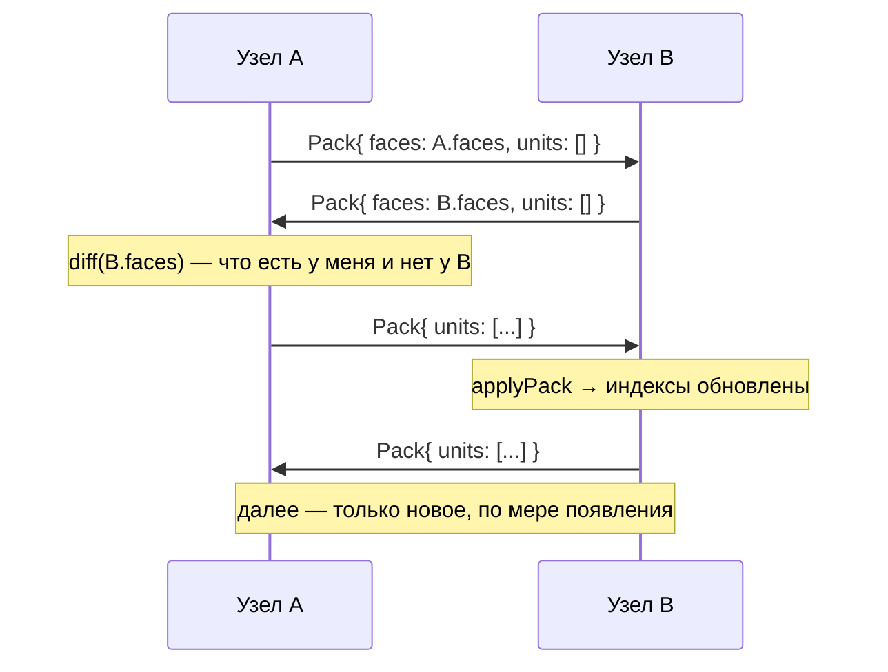

# 08. Протокол синхронизации

Дельта-репликация без подтверждений. Порт `Face` / `diff` / `Yard` / `Port`.

---

## 1. Face — векторные часы с контролем полноты

```ts
export class Face { time = 0; tick = 0; summ = 0 }
export class FaceMap extends Map<PeerStr, Face> {
  stat = new Face()                    // кумулятивный по всем пирам
  sync(other: FaceMap): void
  peerTime(peer, time, tick): void
  peerSumm(peer, summ): void
  tick(peer): Face                   // сгенерировать следующую монотонную метку
}
```

`time`/`tick` — «докуда я видел этого пира».
`summ` — **сколько юнитов этого пира у меня есть**.

`summ` — то, чего нет в классических векторных часах, и главная находка baza.
Часы отвечают на «что нового», но не ловят **выборочную потерю** юнита в
середине истории. Счётчик ловит:

```ts
if (skippedCount > peerFace.summ) {
  warn('Fail Summ', { peer, skippedCount, peerFace })
  // отдать пиру ВСЮ историю этого пира, а не только дельту
  for (const u of skipped) delta.add(u)
}
```

Порт [land.ts:464-483](../../baza/land/land.ts#L464-L483).

---

## 2. Обмен



**Подтверждений нет.** Полагаемся на транспорт: TCP/WebSocket либо доставит,
либо оборвётся, а при реконнекте всё начнётся с обмена фейсами.

`diff(skipFaces)` возвращает не только юниты, но и **`Pass`'ы их авторов** —
иначе получатель не сможет проверить подписи. Порт
[land.ts:417](../../baza/land/land.ts#L417).

---

## 3. Port — абстракция канала

```ts
export interface Port {
  send(bytes: Uint8Array): void
  onMessage(cb: (bytes: Uint8Array) => void): () => void
  readonly closed: boolean
  close(): void
}
```

Всё, что летит по любому порту, — это `Pack`. Никаких типов сообщений, никаких
JSON-конвертов. Отписка от ленда — пустой `Pack` для этого ленда.

---

## 4. Yard — синхронизатор

```ts
export class Yard {
  masters(): readonly Port[]                  // исходящие (мы клиент)
  slaves = new ReactiveSet<Port>()            // входящие (мы сервер)
  landsActive(port: Port): ReactiveSet<LandId>     // что порт у нас запрашивал
  landsPassive(port: Port): Set<LandId>            // что мы запрашивали у порта
  faceOf(port: Port, land: LandId): FaceMap | null
  syncLand(land: LandId): void
  forgetLand(land: LandId): void
  income(port: Port, bytes: Uint8Array): void
}
```

Реактивность здесь работает на нас: `syncPortLand([port, land])` — это `memKey`-канал,
и он **сам пересчитывается**, когда меняется `diff` ленда. То есть «отправить
новое» — это не императивный вызов, а следствие инвалидации графа.

Порт [yard.ts](../../baza/yard/yard.ts).

---

## 5. Транспорты

### `wire-bc` — между вкладками

`BroadcastChannel` на каждый ленд: `sync:land:<id>`. Летят сырые паки.
Заменяет весь патч-протокол ([ADR-006](00-decisions.md#adr-006--между-вкладками-ходят-сырые-паки)).

```ts
new BroadcastChannel(`sync:land:${id}`).postMessage(pack.buffer)
```

`ArrayBuffer` передаётся структурным клонированием — быстро, без JSON.

### `wire-sw` — SharedWorker

Роль сужена до двух вещей:
1. **один WebSocket** на origin вместо N;
2. **один писатель** в IndexedDB/OPFS.

Данные при этом всё равно живут в каждой вкладке. Если SharedWorker недоступен
(Safari до 16, приватные окна) — деградируем на прямой WS из вкладки-лидера,
выбранной через `Web Locks API`.

### `wire-ws` — сеть

Субпротокол `sync/1` (версия формата — здесь, см.
[03 §6](03-binary-format.md#6-версионирование)). Бинарные фреймы, ping каждые 30 с.
Реконнект с экспоненциальным backoff и переключением на следующего мастера
из списка.

### `@sync/server` — релей

```ts
import { createServer } from '@sync/server'
createServer({ port: 9090, store: fsStore('.sync') })
```

~200 строк: `ws` + `UnitStore` + `Yard`. Сервер — **не арбитр**: он такой же пир,
просто всегда онлайн и с диском. Может быть полностью слепым, если ленды
зашифрованы.

---

## 6. Список мастеров как данные

Адреса пиров лежат **в самой базе** — порт `Seed` из
[flex.ts](../../baza/flex/flex.ts):

```ts
Seed { peers: [Peer { urls: string[], stat: Stat }] }
```

Бутстрап: приложение стартует с вшитым `seed.pack` в бандле, применяет его,
получает список адресов, коннектится, дальше список обновляется по сети.

Побочный эффект: список серверов можно менять без релиза приложения.

---

## 7. Что отложено

| | Почему |
|---|---|
| WebRTC (p2p) | сначала нужен рабочий релей; сигналинг всё равно через сервер |
| Шардинг лендов по кластерам | нужен при > 10⁶ лендов, не сейчас |
| Компрессия паков | юниты уже плотные; замерить, прежде чем усложнять |
| Приоритезация лендов | нужна при сотнях активных лендов |

---

## 8. Тесты

Ключевой инструмент — **фейковый транспорт**:

```ts
const net = fakeNetwork({ latency: [5, 50], loss: 0.05, reorder: 0.1 })
const a = makeNode(1, net), b = makeNode(2, net)
```

| Тест | Что |
|---|---|
| `sync.basic` | два узла сходятся после обмена |
| `sync.loss` | 5 % потерь → сходятся после реконнекта |
| `sync.reorder` | перестановка пакетов не ломает состояние |
| `sync.partition` | разделение сети на 10 с, независимые правки, слияние |
| `sync.failsumm` | выборочно выкинутый юнит детектится через `summ` и досылается |
| `sync.reconnect` | падение мастера → переключение на следующего |
| `sync.forget` | пустой пак снимает подписку, трафик прекращается |
| `sync.crosstab` | 3 «вкладки» через фейковый BroadcastChannel сходятся |
