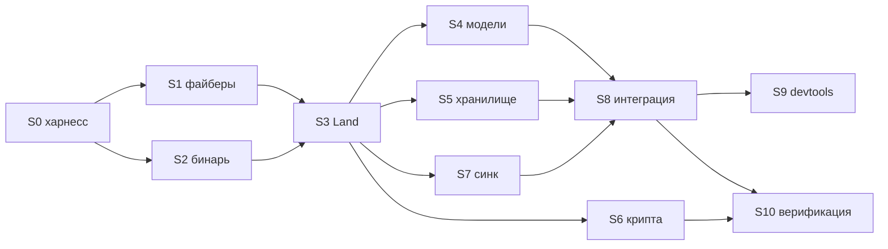

# 11. Дорожная карта

---

## 1. Стадии

| # | Стадия | Пакет | Строк | Недель | Риск |
|---|---|---|---:|---:|---|
| **S0** | Каркас и мультипировый харнесс | инфра | 200 | 0.5 | 🟢 |
| **S1** | Файберный рантайм | `@sync/fiber` | 1260 | 2.5 | 🔴 |
| **S2** | Бинарный слой | `@sync/core` | 900 | 1.5 | 🟢 [замеры](#замеры-s2-2026-08-15) |
| **S3** | Land + `order()` | `@sync/core` | 1200 | 2.5 | 🔴 |
| **S4** | Модели: схема — источник истины | `@sync/core` | 900 | 1.5 | 🟢 [ленд](#ленд-s4-2026-08-16) · [модели](#модели-s4-2026-08-16) |
| **S5** | Хранилища | `@sync/store-*` | 700 | 1.0 | 🟢 |
| **S6** | Крипта и права | `@sync/crypto` | 600 | 1.5 | 🟡 |
| **S7** | Синхронизация | `@sync/wire-*` | 800 | 1.5 | 🟡 [bc готов](#s7-bc-2026-08-16), ws/sw/server впереди |
| **S8** | Мост `@sync/vue` + playground (ADR-018: движок не воссоздаётся) | `@sync/vue` | 250 | 0.5 | 🟡 [мост готов](#s8-мост-2026-08-16), playground впереди |
| **S9** | DevTools | `@sync/devtools` | 500 | 1.0 | 🟢 |
| **S10** | Верификация и бенчи | тесты | 500 | 1.0 | 🟢 |
| S3.5 | Tine и Area | `@sync/core` | 500 | 1.0 | 🟡 отложено |
| | **Итого** | | **~8700** | **~16.5** | |

Оценка — для одного человека в нормальном темпе. Две стадии с 🔴 могут
разъехаться вдвое: S1 — потому что зависит от неизученного поведения
`alien-signals/system` под Suspense, S3 — потому что это алгоритм.

### MVP (~10 недель)

`S0 → S1(F1–F4) → S2 → S3 → S4 → S5(memory+idb) → S7(bc) → S8(M1)`

Без крипты, прав, PoW, Tine/Area, серверного транспорта, DevTools. Получается
local-first хранилище с кросс-таб синхронизацией — достаточно, чтобы поехал
[kcal](../../kcal) и чтобы проверить модель на реальном приложении.

Права и сеть добавляются потом — они ортогональны и не требуют переделки ядра.

---

## 2. Порядок и зависимости

S2 можно вести параллельно с S1 — они не пересекаются.

---

## 3. Definition of Done по стадиям

У каждой стадии **два гейта** — корректность и производительность
([правило 2](../PRINCIPLES.md#правило-2--тестируем-всё-и-на-каждом-этапе--корректность-и-производительность)).
Стадия не закрыта, пока не выполнены оба. Числа в колонке «бюджет» —
предварительные ориентиры, уточняются первым же замером и после этого
фиксируются в `bench/budgets.json`.

| | Гейт корректности | Гейт производительности (бюджет) |
|---|---|---|
| **S0** | `pnpm -r build && pnpm -r test` зелёные; `@sync/core` импортируется в чистом Node без Vue в графе зависимостей; харнесс работает на заглушках | инфраструктура бенчей: `mitata`, `bench/budgets.json`, CI-сравнение с базой, прогон в двух движках (Node + Chromium), `bench/assert-opt.mjs` на `--allow-natives-syntax`, heap-delta через `--expose-gc` |
| **S1** | Порт `../mol/wire/*.test.ts` (~1200 строк) + собственные R1–R6 из [02 §10](02-runtime-design.md#10-риски-и-как-их-снимать) | см. [замеры ниже](#замеры-s1-2026-08-15) — перф-гейт пройден |
| **S2** | Golden-vectors зафиксированы; fuzz round-trip 10⁵ значений; одинаковые хэши в Node и Chromium | кодирование значения ≤ 1 мкс · `packDecode` 10 000 юнитов ≤ 20 мс · ≤ 56 Б на юнит в памяти |
| **S3** | ✅ `orderNaive` ≡ `order` на ~89 000 сверенных состояний; 6 свойств сходимости; adversarial-сюита. Осталось: `applyPack`, права, шифрование | ✅ `order()` на 1000 детей — **109 мкс** при бюджете 2 мс (запас ×18). Сравнение с портом `sand_ordered` — см. [замеры S3](#замеры-s3-2026-08-15) |
| **S4** | Порт тестов atom/list/dict/text/cast; `expectTypeOf` на все формы схем; юнит с неверным типом не роняет чтение | чтение поля модели ≤ 0.5 мкс (тёплый кэш) · `items(next)` на 1000 элементов с одной правкой → ровно 1 новый юнит · вставка символа в текст 100 КБ ≤ 1 мс |
| **S5** | `store.kill9` на 1000 позициях обрыва | 100 000 юнитов: `load` ≤ 500 мс, `save` батчем 1000 юнитов ≤ 30 мс · после 10 000 save/delete файл ≤ 1.3× от полезного объёма |
| **S6** | Подделка подписи отвергается; подпись из ленда A не проходит в B; понижение прав каскадно чистит; сетевой юнит не в `trusted` | подпись пачки из 10 юнитов ≤ 2 мс · проверка 1000 подписей батчем ≤ 200 мс · расшифровка 1000 юнитов ≤ 100 мс · PoW не блокирует главный поток (замер долгих задач = 0) |
| **S7** | Сходимость при 5 % потерь, реордере и партиции на 10 с; `Fail Summ` детектирует выкинутый юнит | `diff()` на ленде из 100 000 юнитов ≤ 30 мс · кросс-таб доставка ≤ 5 мс · трафик на «пустую» синхронизацию ≤ 1 КБ |
| **S8** | Playground: две вкладки, офлайн, совместный текст, один стор для запроса и правки, time travel | холодный старт до первого рендера из IDB (10 000 юнитов) ≤ 300 мс · бандл приложения не вырос против старой версии |
| **S9** | Time travel проигрывает историю; инспектор файберов показывает, кто чего ждёт | DevTools полностью вырезается из прод-сборки (проверка размера) |

### S8, мост (2026-08-16): @sync/vue по 05 §1.8 {#s8-мост-2026-08-16}

Владелец проекта закрыл вопрос: vue-sync-engine не переписывается и не
воссоздаётся — его предметная область (серверный кэш: запросы, патчи, очередь
мутаций, нормализация) в local-first архитектуре исчезла ([ADR-018](00-decisions.md)).
Vue-приложению нужен тонкий мост, и он достроен по спроектированному в
[05 §1.8](05-model-api.md) API: `provideSpace`/`useSpace` (символьный
`InjectionKey`), `useDoc` (тот же `===`-стабильный хендл, что у `space.doc`, —
безопасен для проброса пропом; адрес строкой для маршрутов), `useModel`
(`WritableComputedRef` поверх канала, `undefined` записью не становится) — поверх
уже живших `createSync`/`useSync`/`useValue`. 12 тестов, включая настоящий
`provide`/`inject` через SSR-рендер.

Сборка приложения — четыре строки и намеренно НЕ спрятана в мост: ленд с
`randomSession()`, `openVault`, `syncTabs`, `createSpace({ready: vault.ready})` —
приложение обязано видеть и энтропию, и выбор хранилища.

Осталось от S8: playground (он же приёмочный стенд — две вкладки, офлайн,
совместный текст) и бюджет холодного старта ≤ 300 мс из IDB на 10 000 юнитов.

### S7, часть bc (2026-08-16): канал вкладок {#s7-bc-2026-08-16}

MVP-часть синхронизации: `wire-bc` — сырые пачки через `BroadcastChannel`
(docs/08 §5), фейсы с `summ`, дельта по водяному знаку. Оба бюджета стадии взяты
с первого прогона: **доставка post → чтение у соседа 1.20 мс при бюджете 5**
(пол — голый `postMessage`, 3.4 мкс), **пустое рукопожатие 376 Б при бюджете
1 КБ** (три сообщения). 15 новых тестов: сходимость трёх вкладок, встречная
дельта, `Fail Summ`, выносные значения приветом и краном, отсутствие эха,
молчание после сходимости, дым на настоящем канале.

**Протокол — три вида пачки и ни одного типа сообщений**: привет (фейсы без
юнитов), ответ (дельта плюс фейсы), поток (юниты без фейсов). Реплику порождают
только фейсы — обрыв цепочки доказывается, а сторож «канал не замолкает» стоит
прямо в тестовой ступице. Исходящее идёт **краном ленда** (`Land.tap`) — вторым
потребителем рядом с журналом хранилища: журнал собирает всё принятое (писатель
обязан сохранить услышанное), кран — только своё (на общем канале пересылка
чужого была бы эхом).

**ADR-017 закрыл дыру S4 про две вкладки**: сеанс чеканки — 24-битное начало
кольца счётчика с пропуском занятых, энтропия у обвязки (`randomSession()`), ядро
по умолчанию детерминировано. Тест «две вкладки не теряют ни одной правки» —
зелёный с сеансами; бессессионный режим остался красным намеренно, как документ
об однописательности умолчания.

**Три дефекта, найденных собственными тестами до того, как код увидел мир:**

1. **Привет пустой вкладки побайтово совпадал с отпиской** — ноль фейсов, ноль
   юнитов. Старожилы молчали, вошедшая не получала ничего. Лечение: привет
   всегда несёт свой нулевой фейс «я этот пир, видел ноль», а нулевые фейсы не
   считаются отставанием — иначе две сошедшиеся вкладки перекидывались бы
   фейсами вечно.
2. **Направление «вошедший → старожил» умирало молча**, когда старожилу нечего
   было слать: он не отвечал, и вошедшая не знала, что это ЕЙ есть что слать.
   Лечение: ветка «назваться» — отстал я, шлю свои фейсы; обрыв цепочки
   держится на том, что «я отстал» и «дельта пуста» несовместимы.
3. **Сеансы ослепили векторные часы** — цена ADR-017, которую он сам не увидел:
   знак индексируется пиром, а сеансы расщепили пира на несколько одновременных
   писателей. Две офлайн-вкладки пишут с одинаковой меткой `(time, tick)` при
   разных `self` — знаки и счётчики совпадают, дельта слепа в обе стороны.
   Лечение: знак достоверен только СТРОГО ниже своей секунды, пограничная
   секунда пересылается целиком, `Fail Summ` считает «мог видеть» включительно.

**Не входит в эту часть** (остальной S7): `wire-ws`, `@sync/server`, `wire-sw` с
выбором писателя через Web Locks (он же снимет ограничение «одна вкладка —
писатель» из S5), фейковая сеть с потерями и реордером, `sync.partition`.

### Модели S4 (2026-08-16): слой собран {#модели-s4-2026-08-16}

Слой моделей построен по [05](05-model-api.md): значения и линзы, реестр,
документ, пространство, атом, списки с реконсиляцией, словари, токенизированный
текст, ссылки и `cast`. **923 теста** в `@sync/core`, типы чистые, тесты типов
идут в общем прогоне.

**Главная находка — дефект в нашем же файберном ядре, найденный первым настоящим
потребителем.** `computed.keyed` подметал осиротевшие ключи «раз в сотню
промахов», а подметание — это обход ВСЕЙ карты: суммарно O(n²/100) при
обещанном в комментарии амортизированном O(1). Слой моделей стал первым, у кого
ключ — документ, и дефект вылез сразу: цена промаха 325 нс на тысяче ключей →
**1705 нс на пятидесяти тысячах**, холодное чтение поля 2.06 → **44.6 мкс**.
Лечение — водораздел «подмести, когда карта выросла вдвое»: цена промаха стала
плоской (162 нс на 50 000), первая запись 18.5 → 6.2 мкс.

Это ровно то наблюдение, что записано в PRINCIPLES отдельной строкой: **свои
тесты не видят целого класса ошибок, и второй потребитель — отдельный вид
проверки**. Ядро прожило всю стадию S1 с квадратичной сложностью на горячем пути
и 105 зелёными тестами.

**Замеры слоя** (бюджеты зафиксированы до запуска, рядом — пол платформы):

| гейт | замер | бюджет | пол |
|---|---:|---:|---|
| `field/warm` — чтение поля на тёплом кэше | **12.6 нс** | 500 нс | голый `computed.keyed` — 11.8 нс, то есть ×1.06 |
| `field/warm` heap-delta | 0 Б | 0 Б | — |
| `field/neighbour` — правка соседнего поля | **0 пересчётов** | 0 | решение Р3 работает |
| `doc/open` — хендл на 8 полей | 1.58 мкс | 2.00 мкс | 1.00 мкс |
| `doc/reopen` | 14.0 нс | 100 нс | два `Map.get` |
| `write/idempotent` — `x(x())` 10 000 раз | **0 новых юнитов** | 0 | — |

Тёплое чтение вышло дешевле обещанного в [05 §7.1](05-model-api.md) (12.6 нс
против оценки 20–30): плата за решение Р2 в тёплом пути практически исчезла, весь
путь — это `Map.get` по числу плюс `Fiber.read`.

**Три формулы «пола платформы» в [05 §8.5](05-model-api.md) описывали не тот
объём работы**, из-за чего два бюджета лежали ниже собственного пола: `doc/open`
не считал ни `$`, ни карту идентичности (пол 1.00 мкс при бюджете 1.00 — запас
1 %, то есть бюджет проверял совпадение, а не код); `write/first` не включал
обязательное чтение победителя LWW. Исправлены по замеру, исходные обещания
оставлены рядом.

**Осталось красным — два долга, оба с названной причиной.**

*Длинные значения.* Обычный текст длиннее 62 байт (31 кириллическая буква) в юнит
не помещается и требует `ball`, то есть хранилища S5. Отказ приведён к ошибке
своего слоя с указанием стадии — раньше наружу летел `UnitError` бинарного
слоя, — и записан красным тестом, который позеленеет сам, когда S5 дыру закроет.

*Размер бандла: 22.8 КБ при бюджете 20.* Гейт заодно исправлен — он мерил barrel
целиком, а barrel потребитель не платит никогда: бандлер отряхивает незваное.
Судит теперь **реалистичный импорт** (открыть пространство, объявить модель,
прочитать поле) — тот же принцип, что «минифицированный, а не как есть».
Причина превышения структурная и названа прямо в выводе гейта: `Land` — **класс**,
а методы класса не отряхиваются, поэтому приложение, которое ни разу не
синхронизируется, всё равно везёт `adopt`, `packDecode` и разбор всех четырёх
видов юнита. Лечится сужением класса (узкое ядро плюс свободные функции для
необязательного), а не правкой бюджета. Проверено, что лишнего нет: наивный
оракул `orderNaive` и стенд `Replica` в бандл не попадают.

### Ленд S4 (2026-08-16): что построено и что осталось красным {#ленд-s4-2026-08-16}

`Land` на байтах собран по [ADR-016](00-decisions.md): арена глав, своя таблица
интернирования, уровень пиров первичным хранилищем, плотный список детей,
ленивый вид со свойствами. Восемь бюджетов из восьми взяты, чтение тёплого узла
— **9.7 нс при бюджете 72**, память 181.6 Б/юнит.

**Найдено состязательной проверкой и починено** (каждое с регрессией):

- **Ничья решалась порядком доставки.** `cmpAt` сравнивает только метку, и при
  совпавших `(time, peer, tick)` побеждал пришедший первым. Две реплики с одним
  набором юнитов сходились к РАЗНЫМ значениям, а цикл «применять, пока `apply` не
  вернёт 0» вставал, приняв расхождение за неподвижную точку. Лечение — арбитр
  последней инстанции по байтам, тот же канон, что у `peer` в ADR-015.
- **Раскладка зависела от порядка доставки** — тот же корень, но в `order`:
  `Array.sort` стабильна, и на ничьих сохранялся порядок группировки. Восстановлен
  арбитр по `self` из S3.
- **Причинно поздняя правка проигрывала тому, что ленд уже видел** — часы
  обновляли метку только под строго новый максимум.
- **`move`/`remove` теряли `tag`** — пересобирали юнит из разобранного значения.
  Ровно та потеря, которую ADR-016 вменил обычным объектам; байтовый ленд завёл её
  у себя на пути записи, и дифференциальный оракул её увидеть не мог.
- Санд с нулевым `self` делал корень собственным ребёнком; `move` заводил вид на
  каждого живого ребёнка головы; `adopt` держал чужой буфер навсегда.

**Осталось красным — записано тестами `test.fails`, а не забыто:**

| дыра | почему это дыра |
|---|---|
| ленд отбрасывает `gift`/`seal`/`pass` | реплика-транзит пересылает пачку **без прав и подписей** — потеря на приёме, а не отложенный S6 |
| `adopt` сваливает в один ленд юниты всех лендов пачки | своего `LandId` у ленда нет, отфильтровать чужое он не может даже теоретически |
| `move` не работает в списке с большим сандом | перезапись идёт через разобранное значение, а оно в `ball` |
| ленд с большим сандом не пересобирает свою пачку | `ball` не хранится, при `adopt` байты лежат в арене без ключа |
| две вкладки одного пира теряют правку | **конфликт ADR-006 с ADR-007**: пир общий, счётчик `self` и метка в памяти ленда. Сходимость восстановлена арбитром по байтам, но одна правка исчезает молча |
| один `self` под двумя головами | ленд разрешает победителя глобально, `docs/04 §1` и оракул — по голове. Расхождение молчаливое: генераторы сверки такой вход не порождают |
| арена не переиспользует байты перекрытых версий | память растёт по числу правок, а не по объёму живых данных — ровно на сценарии «правят текст», ради которого затевается local-first |

**Три гейта чинились в этот же заход, и все три — одного рода: обещание было, а
красным оно не становилось никогда.**

1. Двухдвижковый прогон S4 **молча убил**: в бандл бенча попал голый спецификатор
   `@sync/fiber`, браузер его не разрешает, раздел уходил в «пропущено» при коде
   выхода 0. Починено картой импорта; заодно гейт научился отличать «браузера на
   машине нет» (обстоятельство) от «браузер поднялся, а код не поехал» (дефект).
2. Гейт размера не существовал вовсе: из четырёх измерений PRINCIPLES.md размер
   был единственным без автоматики.
3. Сторож регресса только **писал** журнал, ни разу с ним не сравнив. При починке
   выяснилось, что обещанные 10 % лежат ниже шума машины (замер: размах до ×1.35
   на неизменном коде) — порог выведен замером и поднят до 40 %, с разделением
   труда между абсолютным бюджетом и сторожем.

### Замеры S2 (2026-08-15) {#замеры-s2-2026-08-15}

Бинарный слой закрыт: `Link`, `Vary`, `Unit`, `Pack`. **615 тестов**, включая
дифференциальную сверку каждого кодека с независимой второй реализацией
(vary — 45 000 прогонов, unit — 20 000) и кросс-движковый прогон.

**DoD стадии.**

| обещание | статус |
|---|---|
| Golden-vectors зафиксированы | ✅ 12 link · 49 vary · unit · pack |
| Fuzz round-trip 10⁵ значений | ✅ дифференциальные property-прогоны |
| Одинаковые хэши в Node и Chromium | ✅ 142 теста в обеих средах, отпечаток набора совпал побайтово |
| `packDecode` 10 000 юнитов ≤ 20 мс | ✅ 0.89 мс (Node), 0.99 мс (Chromium) |
| ≤ 56 Б на юнит в памяти | ⚠️ сам юнит — ровно 56 Б, но JS-вид сверху стоит 88 Б, а разобранная пачка — 192 Б на юнит |
| Кодирование значения ≤ 1 мкс | ⚠️ 98 нс для inline-значения юнита; для объекта на 139 Б недостижимо |

Строку про память стоит прочесть внимательно. Обещание «≤ 56 Б на юнит»
выполнено буквально: санд с inline-значением занимает ровно 56 байт буфера. Но
`packDecode` заводит на каждый юнит JS-вид, и он стоит ещё 192 Б — на 100 000
юнитов это 19 МБ объектов поверх 5.6 МБ байтов. Своему бюджету (200 Б) вид
удовлетворяет, но самому смыслу бинарного слоя («100k юнитов — это байты, а не
граф объектов для GC») — нет. Разбор обязан стать ленивым: пачка держит байты,
вид заводится на тот юнит, который действительно читают. Это работа [S5](#), где
появляется хранилище и станет видно, какая доля юнитов вообще доживает до
чтения; сейчас записано как долг, а не закрыто галочкой.

Кросс-движковый прогон вышел за рамки обещанного: сверяются не только хэши, а
байты всех golden-векторов и **скорость** — худшее отношение движков `1.17×`.
Отдельная находка: `link/hash` в Chromium **6.5× быстрее**, чем в Node (1.75 мкс
против 11.45) — WebCrypto на коротком входе.

**Два обещания спецификации замер и реализация опровергли.**

`memcmp` 14 байт для LWW **невозможен** — три независимые причины разобраны в
[03 §2](03-binary-format.md#2-unit--юнит) и в реестре (п. 18). Пополевое
сравнение стоит 11.4 нс при бюджете 40, сортировка 1000 юнитов лишь на 21 %
дороже сортировки обычных объектов. Обещание вычеркнуто, контрпример в тестах.

Три бюджета из двенадцати оказались **ниже пола платформы** — не «не выполнены»,
а неверны:

| бюджет | обещано | измерено | пол платформы | исход |
|---|---:|---:|---:|---|
| `encode/arr-100` | 2.00 мкс | 2.54 → **1.78** | — | починен кодом: резерв места разом (реестр, п. 21) |
| `encode/str-4k` | 3.00 мкс | 11.31 | `encodeInto` 7.96 + `isWellFormed` 2.42 = **10.38** | бюджет → 13.00 |
| `decode/str-4k` | 3.00 мкс | 4.98 | `TextDecoder.decode` **4.81** | бюджет → 6.00 |
| `encode/nested` | 1.00 мкс | 1.45 | `JSON.stringify`+`TextEncoder` **1.23** | бюджет → 1.60 |
| `decode/nested` | 1.50 мкс | 1.65 | `JSON.parse` **0.84** | **оставлен красным** |

Последняя строка — единственный настоящий недобор, и он оставлен красным
намеренно. Отставание разложено: словарь из 8 ключей стоит на 570 нс дороже
списка из 8 чисел, из них ~145 нс — сборка объекта в V8 (свежие ключи против
интернированных: 145 против 106 нс), остальное — разбор ключей и проверка
канонического порядка. Лечится интернированием ключей, но кэш — это состояние,
и место ему в слое модели (S4), где набор ключей известен, а не в чистом кодеке.

Правило, выведенное из этого: **бюджет меняется только замером пола, никогда —
фактом промаха** (PRINCIPLES.md, «Гейт производительности»).

**Открытые вопросы, унесённые в S7.** Формат пачки не умеет отдавать большой
санд без приложенного `ball`, хотя [§2](03-binary-format.md) обещает ленивую
загрузку значений — маркера «балл отделён» в раскладке нет. Решается вместе с
тем, как узел запрашивает недостающие баллы.

### Замеры S3 (2026-08-15) {#замеры-s3-2026-08-15}

Порт `sand_ordered` делался ради скорости. Замер (`packages/core/bench/budgets.json`)
дал **отрицательный результат**: однопроходная раскладка выигрывает только там, где
список рос дописыванием в конец.

| набор | однопроходная | группировка | отношение | доля ожидающих |
|---|---:|---:|---:|---:|
| плоский, 1 000 | 109 мкс | 148 мкс | **0.74** | 0 % |
| плоский, 10 000 | 1.61 мс | 2.40 мс | **0.67** | 0 % |
| 30 % надгробий, 1 000 | 226 мкс | 147 мкс | **1.54** | 70 % |
| 200 перемещений, 1 000 | 382 мкс | 299 мкс | **1.28** | 99 % |
| 200 перемещений, 10 000 | 4.02 мс | 3.46 мс | **1.16** | 100 % |
| вложенность 100×100 | 6.02 мс | 6.59 мс | 0.91 | — |

Причина видна в последней колонке: как только в наборе появляются надгробия или
перемещения, почти каждый юнит попадает в очередь ожидания своего `lead` и
разбирается каскадом. Группировка по `lead` с сортировкой групп такой платы не несёт.

**Решение: рабочей остаётся группировка** (`order-naive.ts`), а порт (`order.ts`) —
независимый оракул для дифференциальных тестов. Обе реализации прогоняются всем
набором из 82 тестов; расхождений на ~89 000 сверенных состояний не найдено.

Это ровно тот случай, ради которого правило 2 требует мерить: без замера мы бы
поставили в прод более сложную и на реальных данных более медленную версию просто
потому, что она «оптимизированная».

### Замеры S1 (2026-08-15) {#замеры-s1-2026-08-15}

`pnpm bench` в `packages/fiber`, darwin/arm64, Node v24.19.0. Сырые числа —
`packages/fiber/bench/budgets.json`, они же база для сравнения в CI.

**Синхронный путь**

| Метрика | Замер | Бюджет | |
|---|---:|---:|:--:|
| тёплое чтение атома | **0.6 нс** | ≤ 3000 нс | ✅ |
| пересчёт после инвалидации | **34 нс** | — | ✅ |
| одна зависимость на пересчёте | **9.0 нс** | — | ✅ |
| цепочка из 10, инвалидация листа | **399 нс** | — | ✅ |
| 1000 потребителей, чтение одного | **6.8 мкс** | — | ⚠️ O(подписчиков) |
| создание канала `computed()` | **14.7 нс** | — | ✅ |
| `equals` на мелком объекте | **72 нс** | — | ⚠️ работает на каждом пересчёте |
| `equals` на массиве из 100 чисел | **108 нс** | — | ✅ |

**Асинхронный путь**

| Метрика | Замер | |
|---|---:|:--:|
| круг приостановка → возобновление | **2.05 мкс** | ✅ |
| он же с включёнными трейсами | 14.5 мкс | ⚠️ ×7.1 |
| голый `await` для сравнения | 108 нс | — |
| цепочка из 10 приостановок | 8.7 мкс (**873 нс на ступень**) | ✅ сублинейно |
| куча после 10 000 кругов | **3.3 Б/круг** | ✅ задачи не текут |
| брошенный родитель с висящей задачей | **≈0 Б** | ✅ |

**Память, форма, размер**

| Метрика | Замер | Бюджет | |
|---|---:|---:|:--:|
| аллокаций на тёплом чтении | **0.009 Б/оп** | < 1 | ✅ |
| `Fiber` в памяти | **136 Б** | эталон + 16 | ✅ ровно эталон |
| канал `computed` целиком | **392 Б** | ≤ 420 | ✅ |
| один шейп у атома и задачи | да | обязательно | ✅ |
| оптимизация после реального сценария | сохранена | обязательно | ✅ |
| бандл минифицированный | **3.3 КБ gzip** | ≤ 4 КБ | ✅ |

**Мост в Vue** (`@sync/vue`, шаг F5)

| Метрика | Замер | Бюджет | |
|---|---:|---:|:--:|
| 10 000 полей, точечное обновление | **ровно 1 Vue-эффект** | 1 | ✅ |
| задержка того же обновления | **660 мкс** (с очередью Vue) | ≤ 1 мс | ✅ |
| создание моста | 442 нс | — | ✅ |
| обновление через мост | 217 нс | — | ✅ |

**Против голого `alien-signals`** (правило 2 требует мерить себя против оригинала)

| Сценарий | наш | alien | |
|---|---:|---:|---:|
| пересчёт после инвалидации | 27.6 нс | 29.3 нс | ×0.94 |
| пересчёт со 100 зависимостями | 994 нс | 951 нс | ×1.05 |
| цепочка из 10 | 360 нс | 309 нс | ×1.17 |
| 1000 потребителей | 5.6 мкс | 6.9 мкс | ×0.81 |
| создание узла | 15.5 нс | 3.4 нс | ×4.6 |
| тёплое чтение | 0.6 нс | 0.35 нс | ×1.83 |

Мы вровень с субстратом почти везде. Остаточные 0.25 нс на тёплом чтении — цена того,
что мы проверяем ещё и вид кэша (приостановка/ошибка/холодный режим), которого у
`computed` нет в принципе.

### Что нашли замеры и что из-за этого изменилось

1. **Захват стека приостановки стоил 12.7 мкс из 14.7 мкс круга** — дороже всего
   остального вместе взятого. `new Error()` в обёртке промиса захватывает кадры
   немедленно. Подмена стека переведена под флаг `setSuspendTraces()`, по умолчанию
   выключена; круг подешевел **в 7.4 раза**.
2. **`isSuspend()` делал мегаморфный доступ на самом горячем пути.** Проверка
   «промис ли это» грузит `.then` с произвольного объекта, а в кэшах лежат объекты
   разных форм: чтение объектного значения стоило 8.2 нс против 3.2 нс у числового,
   на дюжине форм — 11.2 нс. Вид кэша переехал в биты флагов выше 32 (`State`),
   которые субстрат не трогает. Разрыв между объектом и числом **исчез**
   (2.58 против 2.61 нс), тёплое чтение подешевело **в 2.1 раза**.
3. **Сборка идентификатора занимала 52 % создания узла** (20 нс из 38). `id` стал
   ленивым геттером, поле убрано: создание подешевело **в 5.5 раза**, до паритета
   с alien.
4. **Бюджет «≤ 64 Б на узел» был неверен.** Эталонный класс с тем же числом полей
   стоит ровно столько же: на darwin/arm64 указатели восьмибайтовые, не сжатые.
   Замер 136 Б для четырнадцати полей — это пол платформы, а не наш перерасход.
   Перерасхода у `Fiber` нет. Бюджет заменён на относительный — абсолютное число
   зависит от платформы и версии V8.
5. **E1 подтверждён численно.** 50 приостановок подряд, 51 различная зависимость →
   создан **51 объект `Link`**. При обрезке хвоста было бы ~1326: разница в 26 раз.
6. **`link()` из alien-signals деоптится по «wrong map»** — видит `Fiber` и `Signal`.
   Полиморфизм на две формы, не мегаморфизм; на цифрах не виден. Кандидат на будущее
   (свести сигнал к файберу), но трогать нечего, пока нет профиля реальной нагрузки.
7. Два замера пришлось переделать, потому что мерили не то: размер узла на дырявом
   массиве-держателе давал «полный атом легче голого Fiber», а тест на брошенного
   родителя удерживал ссылки сам и показывал утечку 2.4 КБ, которой нет.
8. Размер бандла надо мерить **минифицированным**: без минификации те же исходники
   дают 6.45 КБ gzip и бюджет выглядит проваленным.
9. **Порт корпуса `$mol` вскрыл расхождения.** Перенесены `solo` (12 сценариев),
   `dict`/`set` (8) и `plex` (5) — не копией, а переводом семантики: у них
   декораторы на классах, у нас функции.

   Из `solo` упали три: Двенадцать сценариев из
   `mol/wire/solo/solo.test.ts` перенесены как проверка семантики (не копия: у них
   декораторы на классах, у нас функции). Девять прошли сразу, три упали:
   - **структурного сравнения не было вовсе** — пересчёт, давший равный по
     содержимому результат, будил подписчиков. В доке [02](02-runtime-design.md)
     это было описано, а в коде отсутствовало. Для CRDT критично: `items()`
     пересобирает массив на каждом чтении;
   - **запись структурно равного значения в `ref`** тоже считалась изменением;
   - **круговая подписка не распознавалась** — `alien-signals` не зацикливается,
     но и не сообщает, а молча отдаёт недосчитанное значение. Это хуже падения.

   Все три починены. Цена структурного сравнения замерена и оптимизирована:
   отсечение примитивов до вызова вернуло 39.4 → 33.9 нс на пересчёте, а быстрый
   путь внутри циклов ускорил само сравнение в 3–6 раз (массив из 100 чисел:
   693 → 108 нс, вложенная структура: 869 → 260 нс).

   Коллекции прошли все восемь сценариев; недоставало только `forEach`. Из `plex`
   выяснилось ещё два:
   - `Fiber.write()` после перехода на сеттеры в стиле Vue стал **мёртвым кодом** —
     канал зовёт пользовательский `set`, а не переигрывает задачу. Удалён;
   - **нестабильная ссылка в `sync()` делает значение недостижимым навсегда**, а не
     просто замедляет: каждый прогон заводит новую задачу, приостанавливается заново
     и так по кругу. Это оправдывает существование диагностики
     `setTaskMismatchHandler` — без неё ошибка выглядит как зависшая загрузка.

   Отдельно зафиксировано расхождение в семантике записи: в `$mol` запись
   переигрывает вычисление с новым аргументом (`resync`), у нас сеттер обязан
   записать в реактивный источник. Магии меньше, шагов больше, но нет второго
   способа изменить состояние в обход источников.
10. **Второй потребитель нашёл баг ядра.** Мост в Vue не мог показать загрузку:
   переход файбера «значение → ожидание» не будил подписчиков, потому что `put()`
   возвращал `false` для приостановки. `checkDirty` заключал, что пересчитывать
   нечего, и `pending` не поднимался. В `$mol_wire` `emit()` при этом происходит —
   отклонение было моим. Починено, поведение закреплено тестом в самом ядре, а не
   только в мосте. Ни один из 47 существовавших тестов этого не ловил: ядро
   проверялось единственным потребителем — собой.
11. **`Object.defineProperty` на функции стоит 120 нс, а обычное присваивание — 4 нс.**
   Обнаружено при переходе на функциональное API: создание канала подскочило до
   121 нс. Внутренние ручки теперь вешаются присваиванием — 15.5 нс. `WeakMap.set`
   как альтернатива оказался ещё хуже (623 нс).
12. **Проверка холодного режима (`probe`) сначала стоила +47 % на тёплом чтении**
   (1.5 → 2.2 нс). Вместо того чтобы принять регресс, самый частый путь свёрнут в
   одно сравнение битфилда: равенство `flags | cold === Mutable` разом означает
   «посчитано, чисто, не ошибка, не приостановка, режим тёплый». Итог — **0.6 нс**,
   в 2.5 раза быстрее, чем было до появления `probe`, и ×1.83 против alien вместо ×4.36.

Гоняется как `pnpm bench` (семь гейтов), диагностика — `pnpm bench:probe`.
Сырые числа: `packages/fiber/bench/budgets.json`.

Не покрыто и остаётся в S1: инспектор графа (F6) и порт остальных файлов корпуса
`../mol/wire/` (dict, set, plex, sync, async, proxy — ещё ~700 строк).

**S10** · Критерии из [10 §6](10-testing.md#6-что-считается-готово).

---

## 4. Чек-лист перенесённых идей

| # | Идея | Стадия | Док |
|---|---|---|---|
| 1 | Suspense через `throw Promise` | S1 | [01 §4](01-mol-wire-internals.md) |
| 2 | Не резать зависимости при приостановке | S1 | [02 §4](02-runtime-design.md) |
| 3 | `Task` с позиционным переиспользованием → идемпотентные эффекты | S1 | [01 §5](01-mol-wire-internals.md) |
| 4 | `complete_pubs()` как коммит транзакции | S1 | [01 §5](01-mol-wire-internals.md) |
| 5 | Кэш из трёх состояний (значение/ошибка/промис) | S1 | [02 §4](02-runtime-design.md) |
| 6 | Подмена `stack` у промиса ради отладки | S1 | [02 §4](02-runtime-design.md) |
| 7 | GC по достижимости, без `gcTime` | S1 | [02 §7](02-runtime-design.md) |
| 8 | `probe` / `stale` / `race` | S1 | [01 §6](01-mol-wire-internals.md) |
| 9 | Канальная конвенция `f()` / `f(v)` | S1 | [02 §5](02-runtime-design.md) |
| 10 | Гранулярная реактивность коллекций | S1 | [ADR-011](00-decisions.md) |
| 11 | Unit как иммутабельный вид над байтами | S2 | [03 §2](03-binary-format.md) |
| 12 | Один формат для провода, диска и дампа | S2 | [ADR-005](00-decisions.md) |
| 13 | Детерминированный кодек значений | S2 | [03 §4](03-binary-format.md) |
| 14 | Относительные ссылки внутри ленда | S2 | [03 §1](03-binary-format.md) |
| 15 | Land = синк + права + шифрование | S3 | [04 §1](04-crdt-core.md) |
| 16 | `head`/`lead` граф → interleaving-free порядок | S3 | [04 §4](04-crdt-core.md) |
| 17 | LWW по `(time, peer, tick)` | S3 | [04 §3](04-crdt-core.md) |
| 18 | Монотонные логические часы с физической подсказкой | S3 | [04 §3](04-crdt-core.md) |
| 19 | Заморозка времени на транзакцию | S3 | [04 §3](04-crdt-core.md) |
| 20 | Топосортировка юнитов перед применением | S3 | [04 §5](04-crdt-core.md) |
| 21 | `tag` вместо отдельных CRDT-типов | S4 | [05 §2](05-model-api.md) |
| 22 | `cast()` между представлениями | S4 | [05 §1](05-model-api.md) |
| 23 | Реконсиляция вместо перезаписи списка | S4 | [05 §2](05-model-api.md) |
| 24 | Токенизированный текст (абзацы → слова) | S4 | [05 §2](05-model-api.md) |
| 25 | `ensure(config)` — выбор места рождения сущности | S4 | [05 §4](05-model-api.md) |
| 26 | Empire — рекурсивные словари-индексы | S4 | [05 §5](05-model-api.md) |
| 27 | Yin-Yan зеркала | S5 | [06 §4](06-storage.md) |
| 28 | Файл как арена аллокатора | S5 | [06 §4](06-storage.md) |
| 29 | Батч-сохранение внутри тика | S5 | [06 §6](06-storage.md) |
| 30 | Ранг = tier + rate в одном байте | S6 | [07 §1](07-crypto-rights.md) |
| 31 | PoW как часть уровня прав | S6 | [07 §3](07-crypto-rights.md) |
| 32 | Батч-подписи (seal на 10 хэшей) | S6 | [07 §3](07-crypto-rights.md) |
| 33 | Шифрование ленда + обёртка ключа по ECDH | S6 | [07 §4](07-crypto-rights.md) |
| 34 | `rankAudit` — каскадная чистка при понижении | S6 | [07 §5](07-crypto-rights.md) |
| 35 | `trusted` — не перепроверять своё | S6 | [07 §6](07-crypto-rights.md) |
| 36 | Face + `summ` для детекта потерь | S7 | [08 §1](08-sync-protocol.md) |
| 37 | Дельта-синк без подтверждений | S7 | [08 §2](08-sync-protocol.md) |
| 38 | Кросс-таб шина сырых паков | S7 | [ADR-006](00-decisions.md) |
| 39 | Список пиров внутри самой базы (Seed) | S7 | [08 §6](08-sync-protocol.md) |
| 40 | Мультипировые тесты в одном процессе | S0 | [10 §1](10-testing.md) |
| 41 | Time travel по иммутабельной истории | S9 | [09 §5](09-integration.md) |
| — | Tine (форк/мерж лендов) | S3.5 | [04 §7](04-crdt-core.md) |
| — | Area (под-ленды) | S3.5 | [04 §7](04-crdt-core.md) |
| — | Схема как данные (Flex) | отложено | — |

**Не переносим:** плоский namespace и MAM, `.view.tree`, декораторы, хранение
атома в поле хоста, коллекции с одним `pub` на карту, 6-байтовые идентификаторы,
`$mol_fail` при отсутствующем `Pass` (заменён карантином).

---

## 5. Первые три коммита

**C1 · Каркас + харнесс на заглушках (S0).**
`pnpm-workspace.yaml`, `packages/{fiber,core}`, `vitest.workspace.ts`,
`test/harness.ts` с `makeNode`/`deliver`/`converge` поверх пустых интерфейсов.
Мультипировый тест пишется первым — он задаёт форму всего публичного API.

**C2 · Эксперимент R1 (S1, до всего остального).**
Минимальный `Fiber` на `createReactiveSystem`, который приостанавливается на
промисе. Проверить два утверждения из [02 §10](02-runtime-design.md#10-риски-и-как-их-снимать):
- при пропуске `purgeDeps` список зависимостей после resolve идентичен и рёбра
  переиспользованы;
- `peekNextDep` позволяет опознать `Task` на той же позиции.

**Это дешевле всего проверить в первый день. Если не работает — вся [ADR-003](00-decisions.md#adr-003)
пересматривается в пользу своего графа, и лучше узнать об этом сразу.**

**C3 · Наивный `order()` + property-тест сходимости (S3, шаг 1).**
На обычных JS-объектах, до бинарного слоя. Проверяет, что алгоритм понят
правильно, за день вместо двух недель.

---

## 6. Точки принятия решений

| Когда | Что решаем | Если «нет» |
|---|---|---|
| После C2 | `alien-signals/system` пригоден под Suspense? | свой граф (порт `pub`/`sub` из mol, +500 строк, +1 неделя) |
| После S1 | Оверхед моста в Vue приемлем? | кэширование мостов по ключу; в крайнем случае — `@vue/reactivity` как второй бэкенд |
| После C3 | `order()` воспроизводится? | пересмотреть модель списка в пользу RGA/Fugue с нуля |
| После S4 | API моделей удобен на реальном экране? | пересмотр до того, как на нём построена сеть |
| После S8 | CRDT-путь реально проще REST-пути? | оставить оба навсегда, не удалять legacy |
