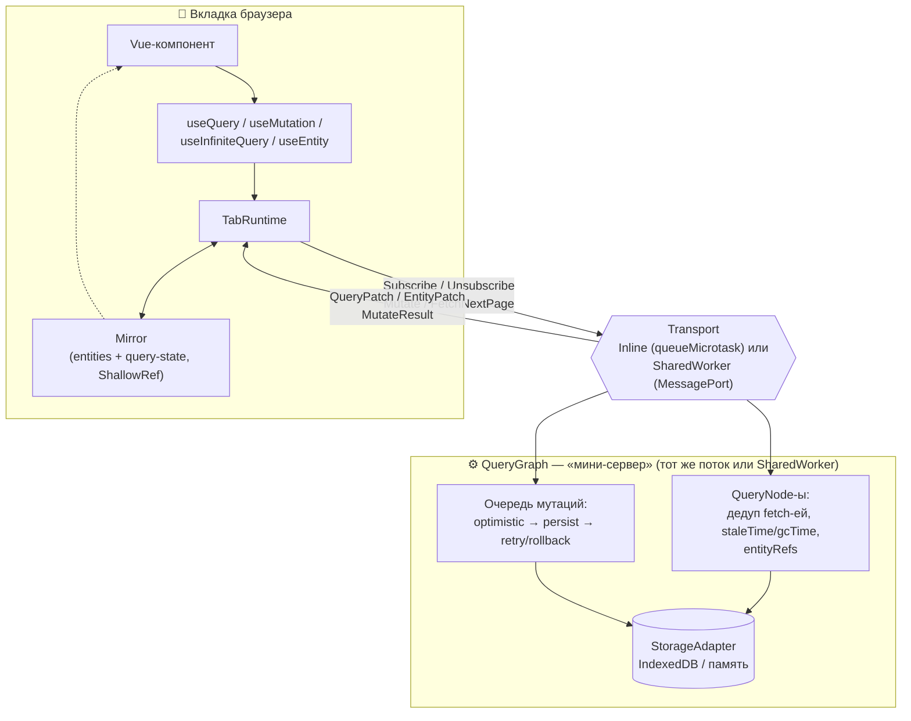
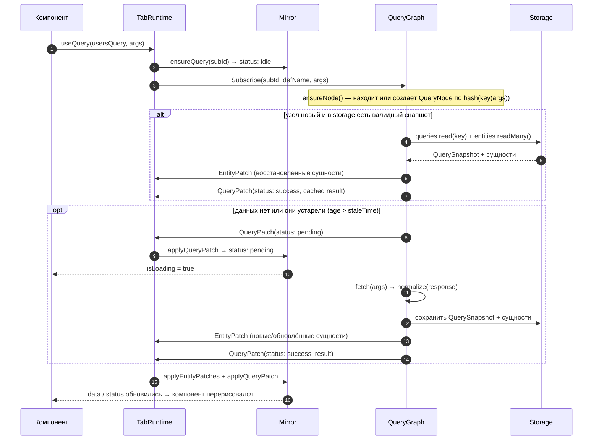
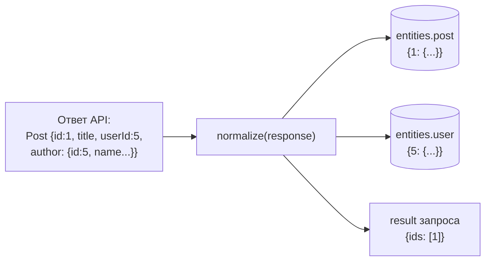
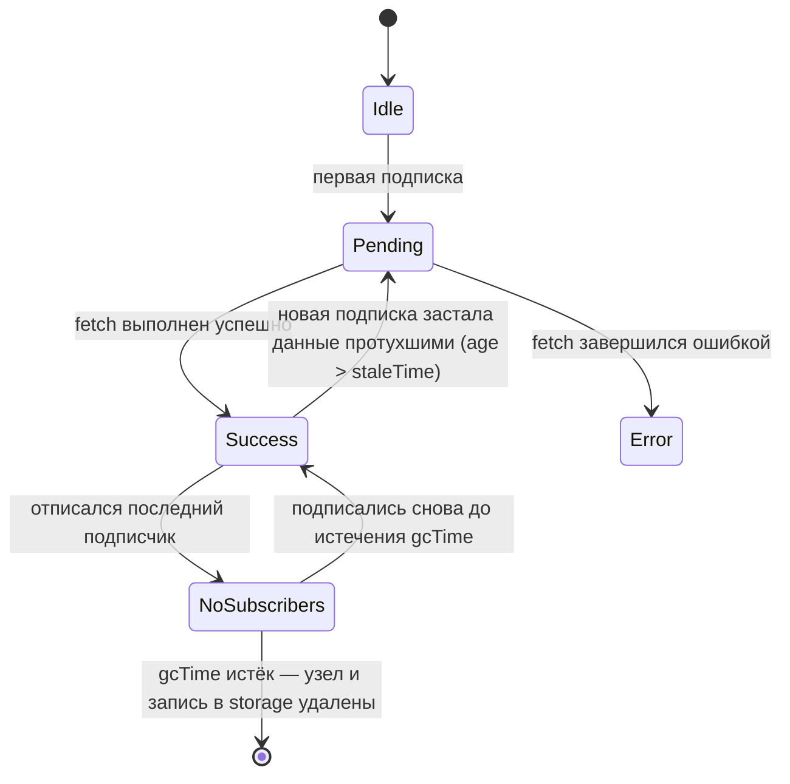
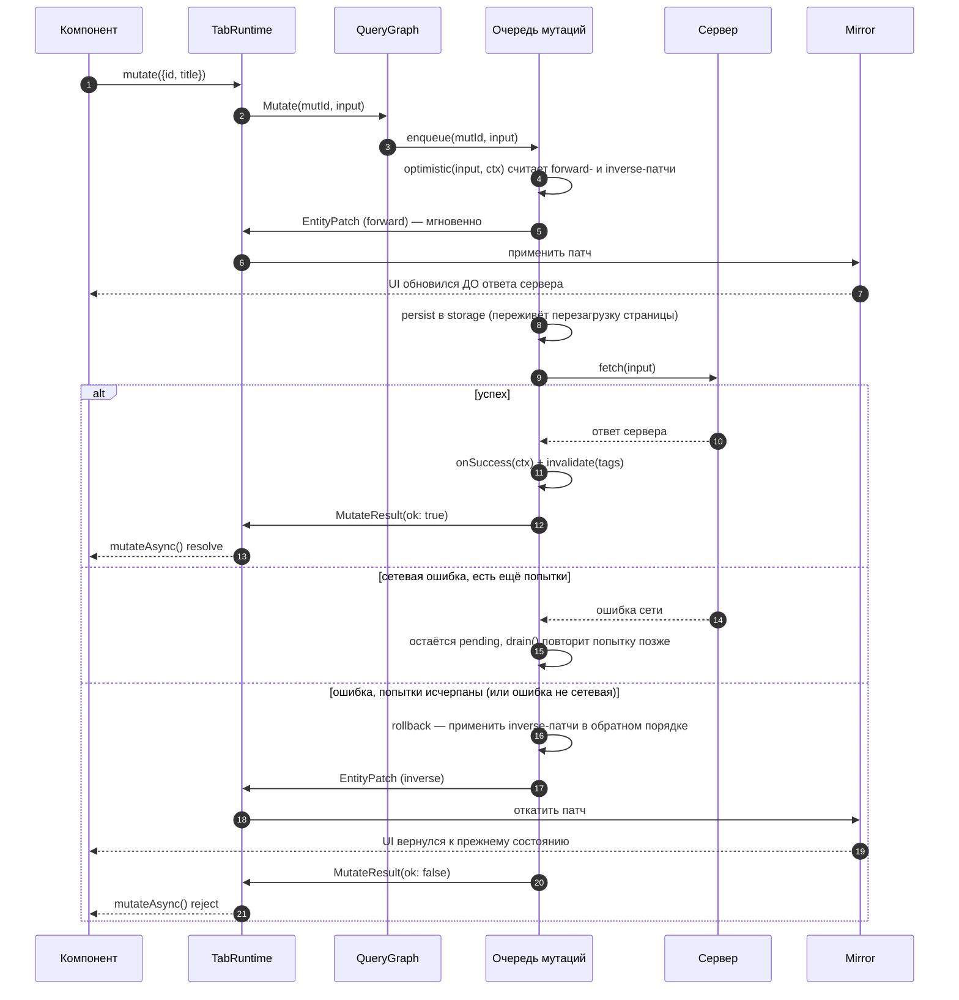
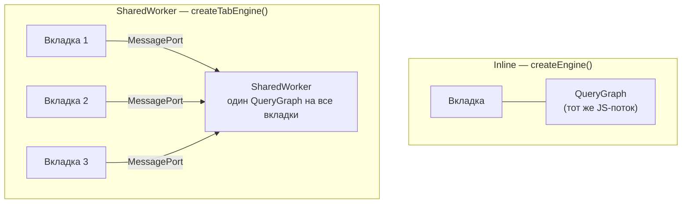
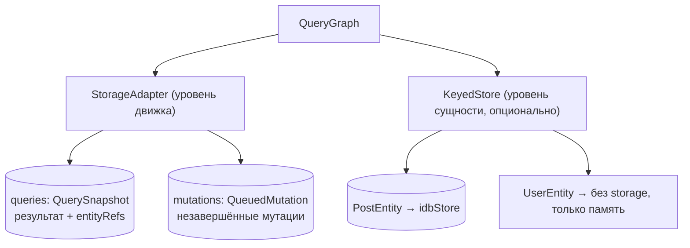

# Как устроен vue-sync-engine

Это объяснение «на пальцах»: что происходит внутри библиотеки от вызова
`useQuery()` до перерисовки компонента. Для справочника по API см.
[README.md](./README.md) — здесь фокус на механике и картинках.

## Зачем он вообще нужен

В обычном SPA каждый компонент сам решает, откуда брать данные: сам
дёргает `fetch`, сам хранит результат в `ref`, сам решает, когда обновить.
Если один и тот же пост показан в двух местах экрана — либо оба компонента
независимо грузят его заново, либо после мутации один обновился, а второй
остался со старыми данными.

vue-sync-engine убирает эту проблему через одну идею: **все данные живут
в одном месте, компоненты только на них подписываются.** Само место —
не «дерево ответов API», а плоский нормализованный кэш сущностей, как
таблицы в базе данных (в духе Apollo / RTK Query), а не как в наивном
`fetch`-кэше, где один и тот же пользователь может быть продублирован
внутри трёх разных ответов запросов.

## Главная идея одной картинкой

Библиотека всегда состоит из двух половин, даже если физически они
работают в одном JS-потоке: **вкладка** (то, что видит пользователь) и
**QueryGraph** — «мини-сервер», который решает, что и когда фетчить.
Между ними — заменяемый транспорт.



Ключевая мысль: **вкладка никогда не фетчит данные сама.** Она только
посылает «хочу подписаться на такой-то запрос» и получает в ответ поток
патчей. Реальный `fetch()` живёт только в QueryGraph.

## Действующие лица

| Кто | Что это простыми словами |
|---|---|
| **Entity** | Тип сущности в кэше — «таблица» (`post`, `user`). Описывает только, как достать `id` у объекта, и опционально — где его персистить. |
| **Query / InfiniteQuery** | Описание запроса: как построить ключ кэша из аргументов, как зафетчить, как разложить ответ на сущности (`normalize`). |
| **Mutation** | Запись: `fetch` + опциональные `optimistic` (мгновенная правка) и `onSuccess` (правка после ответа) + `invalidate` (что перефетчить). |
| **Mirror** | Реактивный «слепок» на стороне вкладки: сущности по типам + состояния запросов. Единственное, что реально читают компоненты. |
| **TabRuntime** | Клиентская логика вкладки: подписки (с дедупом по хэшу ключа), их GC, отправка мутаций, разбор входящих патчей. |
| **QueryGraph** | Серверная логика: хранит `QueryNode` на каждый уникальный запрос, дедуплицирует fetch, гидрирует из storage, рассылает патчи всем подписчикам. |
| **Transport** | Канал сообщений между вкладкой и QueryGraph. Две реализации: `Inline` (тот же поток, батчинг через `queueMicrotask`) и `SharedWorker` (через `MessagePort`). |
| **StorageAdapter / KeyedStore** | Персистентность. Два независимых уровня — см. [раздел ниже](#persistence-два-независимых-уровня). |

## Что происходит по шагам: от `useQuery()` до рендера



Важные детали, которые не видны в коде компонента:

- **Дедупликация по ключу.** `subscribeQuery` хэширует `key(args)`
  (`hashKey`, стабильная сериализация — порядок полей объекта не важен) и
  ищет уже существующую подписку. Если два компонента одновременно
  вызвали `useQuery(usersQuery, ...)` с одинаковыми аргументами — будет
  один `QueryNode` и один fetch на двоих.
- **`isLoading` мигает и при фоновом рефетче.** Если данные уже есть, но
  протухли (`age > staleTime`), QueryGraph сперва отдаёт кэш мгновенно, а
  затем всё равно переводит статус в `pending` на время рефетча. Отдельного
  флага `isFetching`/`isRefetching` в библиотеке нет — `isLoading` покрывает
  оба случая: и первую загрузку, и фоновое обновление устаревших данных.
- **Протухание проверяется только при новой подписке.** Нет ни `setInterval`,
  ни `visibilitychange`/`focus`-слушателей, которые бы сами дёргали рефетч
  фонового запроса. Пока подписчик один и не размонтировался — застоявшиеся
  данные просто лежат в кэше, пока кто-то не подпишется заново (например,
  при возврате на страницу) или пока их явно не инвалидирует мутация.
- **GC-окно на отписку.** `onScopeDispose` вызывает `release()`, но реальная
  отписка (`Unsubscribe` в QueryGraph) откладывается на `staleSubGcMs`
  (по умолчанию 5 c). Это защита от «мигания»: быстрый переход между
  вкладками/роутами не должен рвать подписку и гнать повторный fetch.

## Нормализация: почему кэш плоский

`normalize()` в определении запроса разбирает ответ API на **сущности**
(что идёт в общий кэш) и **result** (тонкая структура из id, которая
хранится именно в этом запросе).



Почему это важнее, чем кажется: если пользователь `5` встречается ещё в
десяти других постах или в отдельном запросе `users.list`, это **один и тот
же объект в `entities.user`**, а не десять копий. `useEntity(UserEntity, 5)`
в любом компоненте — включая совсем не связанные с исходным запросом —
всегда прочитает актуальную версию. Оптимистичная мутация, которая
поправила имя пользователя, мгновенно видна везде, где он упомянут, без
ручной инвалидации каждого места.

## Кэш и время жизни: `staleTime` и `gcTime`

У каждого `QueryNode` есть простой жизненный цикл:



Аналогия — молоко на полке магазина:

- **`staleTime`** — «срок годности для доверия». Пока не истёк, новый
  покупатель (подписчик) берёт с полки без вопросов, fetch не идёт.
  По умолчанию 30 с.
- **`gcTime`** — «через сколько выбросить, если никто не берёт». Отсчёт
  идёт с момента, когда отписался последний подписчик. Если до истечения
  подписался кто-то новый — таймер просто отменяется. Если нет — узел и
  соответствующая запись в `storage.queries` удаляются насовсем.
  По умолчанию 5 мин.

Оба значения задаются дефолтами при бутстрапе (`createEngine({ defaultStaleTime, defaultGcTime })`) и переопределяются на уровне конкретного `defineQuery(...)`.

### Инвалидация

Мутация может явно перевести чужие узлы обратно в `Pending`, указав теги
или сами деф-объекты в `invalidate`. Узлы без активных подписчиков в этот
момент просто помечаются протухшими — рефетч случится при следующей
подписке, а не сразу.

## Мутации: мгновенный UI + автоматический откат

Самая интересная часть. Когда вы вызываете `mutate(input)`, происходит
следующее:



Что стоит понимать про `optimistic`:

```ts
optimistic: (input, ctx) => ctx.patchEntity(PostEntity, input.id, { title: input.title })
```

Вызывая `patchEntity` / `upsertEntity` / `removeEntity`, вы не пишете
rollback руками. Движок сам на лету считает **инверсный патч** (было —
стало наоборот) и применяет его автоматически, если мутация в итоге
провалилась.

### Очередь мутаций — она же офлайн-режим

`QueuedMutation` пишется в `storage.mutations` **до** отправки запроса.
Это значит:

- если вкладку закрыть/обновить посреди мутации — при следующем старте
  движок подхватит незавершённые мутации из storage и продолжит попытки;
- retry идёт, только пока `navigator.onLine` и `attempts < maxRetries`
  (по умолчанию 5); при возврате сети (`online`-событие) очередь сама
  запускает `drain()`;
- сущности, тронутые ещё не завершённой мутацией, «запиниваются»
  (`pinEntities`) — фоновая сборка мусора сущностей (`entityGc`) их не
  тронет, пока мутация не разрешится.

## Два режима движка

Один и тот же `QueryGraph` можно поднять либо в том же потоке, что и UI,
либо в `SharedWorker`, общем на все вкладки одного origin'а.



| | Inline (`createEngine`) | SharedWorker (`createTabEngine`) |
|---|---|---|
| Кросс-таб синхронизация | нет | да, мгновенно |
| Дедупликация fetch | в пределах одной вкладки | глобально на все вкладки |
| IndexedDB | каждая вкладка открывает свою | один общий instance |
| Сложность подключения | минимальная | нужен отдельный worker-файл |

Код компонентов и определения (`defineQuery` и т.д.) не меняются вообще —
разница только в том, как собран `TabRuntime` на старте приложения.

## Persistence: два независимых уровня



1. **Уровень движка** (`StorageAdapter`, `memoryAdapter()` или
   `indexedDBAdapter({ dbName })`) — хранит снапшоты результатов запросов
   и очередь мутаций. Без него движок работает так же, но всё исчезает
   при перезагрузке страницы.
2. **Уровень сущности** (`KeyedStore` в `defineEntity({ storage })`) —
   каждый тип сущности сам решает, персистится ли он, независимо от
   остальных. В демо `PostEntity` живёт в IndexedDB, а `UserEntity` —
   только в памяти, специально для контраста.

Оба уровня работают вместе: снапшот запроса хранит только `entityRefs`
(ссылки `{type, id}`), а сами данные сущностей при гидрации подтягиваются
из своего `KeyedStore`. Если у типа сущности нет `storage` и её нет в
памяти воркера — гидрация признаётся неудачной, снапшот выбрасывается, и
при следующей подписке всё просто перефетчится заново.

## Автодискавери определений через Vite-плагин

Вместо того чтобы руками собирать массивы `entities`/`queries`/`mutations`,
можно раскидать `defineEntity`/`defineQuery`/`defineMutation` по файлам
`*.defs.ts` и один раз подключить плагин:

```ts
syncEnginePlugin({ definitions: ['/src/**/*.defs.ts'] })
```

Плагин сканирует файлы по glob-маске и собирает всё найденное в один
виртуальный модуль `virtual:sync-engine-registry`. Дедуп — по `name`: если
один и тот же деф случайно экспортирован из двух мест, плагин молча
оставит первый найденный.

## Vue DevTools

`installEngine(app, runtime)` в dev-режиме сама подключает кастомную
панель «Sync Engine» с пятью узлами: **Engine** (дефолты, счётчики),
**Queries** (статус/tags/cache-метаданные по каждой подписке), **Entities**
(персистентные vs in-memory, список инстансов), **Mutations** (кольцевой
буфер последних 50) и **Tabs** (обнаружение других вкладок через отдельный
`BroadcastChannel`). В продакшене весь код вырезается через константу
`__SYNC_ENGINE_DEV__`.

## Шпаргалка: что за что отвечает в коде

| Файл | Отвечает за |
|---|---|
| [`createEngine.ts`](./lib/src/createEngine.ts) | Точки входа: `createEngine` / `createTabEngine` / `bootstrapWorker` / `installEngine` |
| [`define.ts`](./lib/src/define.ts) | Фабрики `defineEntity` / `defineQuery` / `defineInfiniteQuery` / `defineMutation`, `Object.freeze` |
| [`tab/mirror.ts`](./lib/src/tab/mirror.ts) | Реактивный кэш вкладки: сущности по типам + состояния запросов, `ShallowRef` на каждую сущность отдельно |
| [`tab/runtime.ts`](./lib/src/tab/runtime.ts) | `TabRuntime`: дедуп подписок по хэшу ключа, GC-таймер отписки, `mutate()` |
| [`worker/queryGraph.ts`](./lib/src/worker/queryGraph.ts) | «Сервер»: `QueryNode`-ы, дедуп fetch-ей, гидрация из storage, инвалидация, entity-refcounting |
| [`worker/mutationQueue.ts`](./lib/src/worker/mutationQueue.ts) | Очередь мутаций: optimistic → persist → retry → rollback |
| [`core/patches.ts`](./lib/src/core/patches.ts) | `applyPatch` + автогенерация инверсных патчей для rollback |
| [`core/queryKey.ts`](./lib/src/core/queryKey.ts) | `hashKey()` — стабильная сериализация ключа (порядок полей объекта не важен) |
| [`transport/InlineTransport.ts`](./lib/src/transport/InlineTransport.ts) | Транспорт в одном потоке, батчинг через `queueMicrotask` |
| [`transport/SharedWorkerTransport.ts`](./lib/src/transport/SharedWorkerTransport.ts) | Транспорт через `MessagePort` поверх `SharedWorker` |
| [`adapters/`](./lib/src/adapters/) | `memoryAdapter` / `indexedDBAdapter` (движок), `idbStore` / `memoryStore` / `noopStore` (сущности) |
| [`composables/`](./lib/src/composables/) | Vue-обвязка: `useQuery` / `useMutation` / `useInfiniteQuery` / `useEntity` / `useEngine` |
